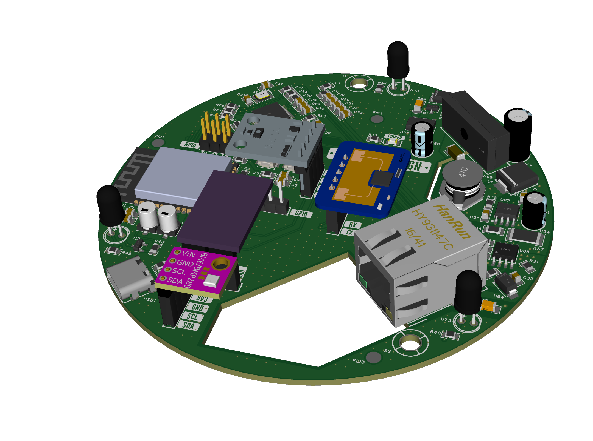

# ESPHome 🧠 MultiSensor Board

This repository contains the full hardware and firmware implementation of a smart multisensor platform powered by ESP32-S3, designed for home and building automation environments.
The purpose of this sensor is to install it on the room ceiling and detect the data by transmitting it to MQTT server, and use the IR led for communication with equipment such as televisions, air conditioners and more.
The idea was to have a sensor that could be freed from the difficulty of running power cables and data cables. The use of ethernet cables and POE connection facilitates the entire distribution and guarantees the correct connection in case of Wi-Fi difficulties.
It is still possible to connect it with a USB-C port and a wireless network but it was not designed for that.

---
## 🔧 Features

- **ESP32-S3 microcontroller** with USB-C and GPIO breakout
- **Power-over-Ethernet (PoE)** with isolated DC-DC conversion (via TPS2376 + F0505S module)
- **W5500 Ethernet controller** with magnetics and RJ45 connector
- **Sensor suite includes:**
  - BME280 for temperature, humidity, pressure (I²C)
  - BH1750 light sensor (I²C)
  - SCD41 for CO₂, humidity, temperature (I²C)
  - HLK-LD2410C-P mmWave presence sensor (UART)
  - SFH4546 IR emitters
- **GPIOs for external modules**
- **3.3V and 5V power rails with LDO and flyback conversion**
- **Status LEDs and reset circuitry**
- **Designed in EasyEDA (3 schematic sheets)**

## 🖼️ Board Preview

Below is a 3D render of the custom MultiSensor PCB, including:
- ESP32-S3
- W5500 Ethernet with PoE
- Sensors (BME280, BH1750, SCD41, HLK-LD2410C-P)
- USB-C and GPIO headers

---
## 📡 Firmware

The board runs on **ESPHome**, fully integrated with:
- MQTT publishing (structured per sensor category)
- Web interface on Ethernet
- OTA update
- Diagnostics, presence, and environmental data

See Sensor.yaml for the complete ESPHome configuration.
Please consider that in this case, for the publication of the topics, the file is set having different floors and different rooms, the names are just an example.

## 📂 Folder Structure

- `Software` → ESPHome configuration
- `Hardware` → Complete hardware schematic (3 pages) and PCB design
- `3D design` → **Under developement** 3D model for 3D printed case
- `LICENSE` → MIT License

---
## 🧰 Getting Started

1. Flash `Sensor.yaml` using ESPHome Dashboard or CLI.
2. Connect the board to a PoE-enabled Ethernet switch or inject 5V via USB-C.
3. Open the web interface at the IP assigned via DHCP.
4. Integrate with Home Assistant or any MQTT broker at `192.168.1.XXX`.

---
## ⚠️ Disclaimer

This project is provided **for educational purposes only**.

The author(s) of this repository do **not take any responsibility** for:
- Incorrect use of the design or schematics
- Damage to equipment, persons, or property
- Installation in unsafe or non-compliant environments

Any implementation of this project in real-world systems should be done **under the responsibility of a qualified professional**, and in compliance with local regulations and safety standards.

By using this material, you acknowledge that it is offered **as-is, without warranty of any kind**, and you agree to use it **at your own risk**.

## 🌍 Language Note

Please note that some of the documentation and schematic files included in this project are written in **Italian**.

This is because the project was originally developed and documented for local use. I plan to translate all materials into **English** as time permits, to make the project more accessible to the international community.

If you need help understanding any specific part, feel free to open an issue or contact me — I'll be happy to help.

Grazie for your patience! 🇮🇹🙂
